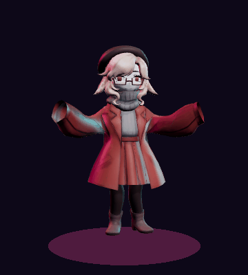
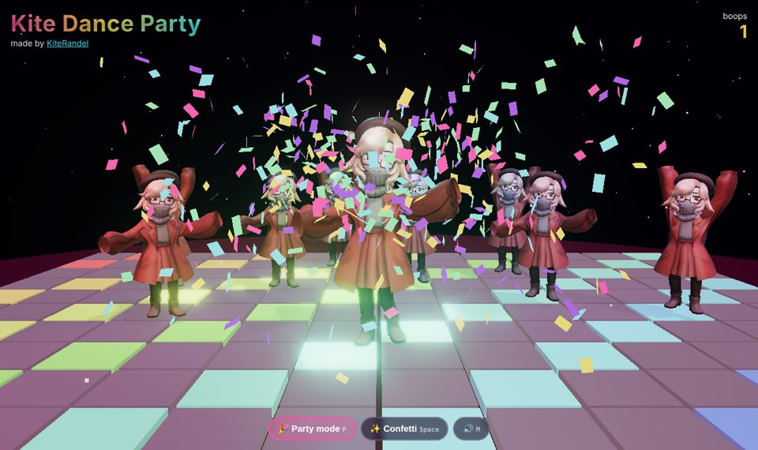
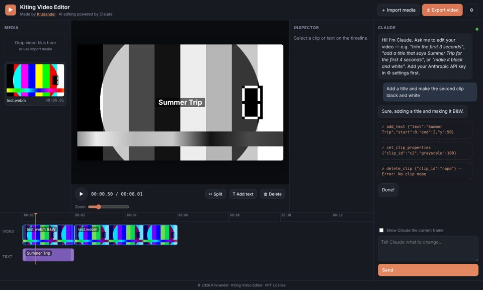
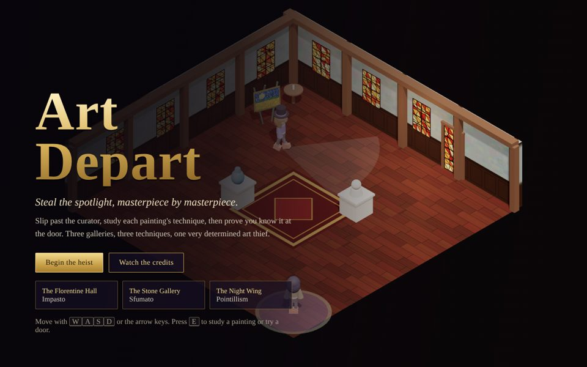
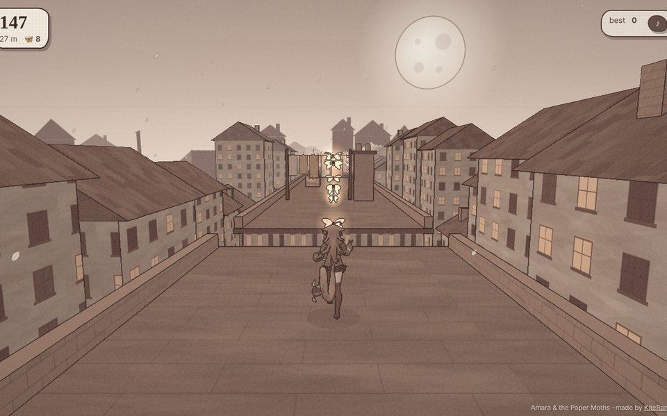

  

### Hi, I'm KiteRandel

I'm a VTuber who models, rigs, and programs.

- That's **Kite** dancing over there. I modeled, rigged and animated them in **Blender**
- Kite stars in my three.js scene, **[Kite Dance Party](https://kiterandel.github.io/kite-dance-party/)**
- I like building games and web toys with **three.js** and **JavaScript**
- Some neat things live here **[kiterandel.github.io](https://kiterandel.github.io)**

  

 

## Featured projects

<table>
  <tr>
    <td width="50%" valign="top">
      
      <h3><a href="https://kiterandel.github.io/kite-dance-party/">Kite Dance Party</a></h3>
      Kite dancing on a light-up disco floor to a beat made live in your browser. Boop Kite, throw confetti, call in backup dancers. 
      <b>Blender · three.js · Web Audio</b> · <a href="https://github.com/KiteRandel/kite-dance-party">code</a>
    </td>
    <td width="50%" valign="top">
      
      <h3><a href="https://kiterandel.github.io/kiting-video-editor/">Kiting Video Editor</a></h3>
      A video editor that runs in the browser: trim, split, filters, text, export. Claude is built in, so you can just say what to change. 
      <b>JavaScript · Canvas · Claude API</b> · <a href="https://github.com/KiteRandel/kiting-video-editor">code</a>
    </td>
  </tr>
  <tr>
    <td width="50%" valign="top">
      
      <h3><a href="https://ellopez21.github.io/Art-Depart/">Art Depart</a></h3>
      An art-heist stealth game. Slip past the curator, study each painting's technique, then prove you know it at the door. Made with Erik Lopez. 
      <b>three.js · educational</b> · <a href="https://github.com/ElLopez21/Art-Depart">code</a>
    </td>
    <td width="50%" valign="top">
      
      <h3><a href="https://kiterandel.github.io/paper-moths/">Amara &amp; the Paper Moths</a></h3>
      An endless rooftop run at dusk, drawn like a sepia ink sketchbook. Chase glowing paper moths, leap between roofs and duck under the laundry. 
      <b>Blender · three.js · toon shading</b> · <a href="https://github.com/KiteRandel/paper-moths">code</a>
    </td>
  </tr>
</table>

## Tools I use

  
  
  
  
  
  
  

made by KiteRandel

